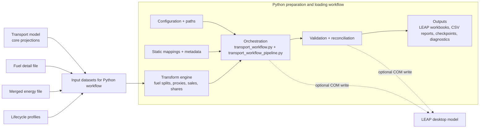

# Process Flow (Plain English)

This document explains what the transport pipeline does from start to finish, in simple terms.

## System view: transport model vs Python prep pipeline

Editable diagram source: `docs/leap-system.drawio`

Use this view to explain scope:

1. The **transport model** is one upstream component that produces core outputs.
2. The **Python system** then does a larger set of preparation, mapping, validation, and export steps so LEAP can consume those outputs safely.

The key message for documentation readers: the transport model logic is relatively compact, while most operational complexity sits in the Python preparation and quality-control pipeline.

## 1) What this script is trying to do

`code/transport_workflow.py` is the run entrypoint, and delegates to
`code/transport_workflow_pipeline.py` to convert transport model outputs into LEAP-ready expressions and workbooks.

It can run:

1. One economy (for example `20_USA`)
2. All economies separately
3. A synthetic `00_APEC` run (aggregated from all economies)
4. Both separate + `00_APEC`

It can also reconcile the LEAP output against merged energy totals.

## 2) Main input files

Per economy:

1. Transport model output (regular): `data/transport_data_9th/model_output_detailed_2/*.csv`
2. Fuel detail file: `data/transport_data_9th/model_output_with_fuels/*.csv`

Shared:

1. Merged energy (pre-trump variability set):
   - `data/merged_file_energy_ALL_20250814_pretrump.csv`
   - `data/merged_file_energy_00_APEC_20250814_pretrump.csv`
2. LEAP import template:
   - `data/import_files/DEFAULT_transport_leap_import_TGT_REF_CA.xlsx`
3. Lifecycle profiles:
   - `data/lifecycle_profiles/vehicle_survival_modified.xlsx`
   - `data/lifecycle_profiles/vintage_modelled_from_survival.xlsx`

## 3) Runtime selection and modes

At the top of `code/transport_workflow.py`:

1. `TRANSPORT_ECONOMY_SELECTION`
2. `TRANSPORT_SCENARIO_SELECTION`
3. `ALL_RUN_MODE`:
   - `separate`: run each economy independently
   - `apec`: run only synthetic `00_APEC`
   - `both`: run separate economies and synthetic `00_APEC`

If `TRANSPORT_ECONOMY_SELECTION != "all"`, it runs a single-economy path.

## 4) Economy-level input preparation

For each economy run, `prepare_input_data(...)` does this:

1. Read source model data and filter by economy + scenario + year window.
2. Validate required source columns.
3. Expand rows by fuel mapping (`add_fuel_column`).
4. Allocate biofuels/e-fuels using the fuel detail file.
5. Add proxy/combination rows from branch mapping rules.
6. Calculate `Sales` from stock differences.
7. Recalculate shares (`Vehicle_sales_share`, `Stock Share`) so they are consistent.
8. Add special “Other” rows from merged energy using ESTO-to-LEAP mappings.
9. Save a checkpoint in `intermediate_data/`.

## 5) Synthetic 00_APEC input preparation

If `ALL_RUN_MODE` includes `apec`, the script:

1. Prepares each economy input dataframe (same process as above).
2. Concatenates all economies.
3. Aggregates to one synthetic economy `00_APEC`.

Aggregation is done before LEAP measure creation, so weighting works correctly.

### 00_APEC aggregation rules

1. Additive columns (sum): energy, activity, stocks, travel, GDP, population, and other stock/flow totals.
2. Weighted columns (weighted average): efficiency, mileage, intensity, occupancy/load, turnover-like rates, growth/intensity improvement fields.
3. Weight choices: usually `Activity`, fallback `Stocks`; some measures use `Population` or `New_stocks_needed`.
4. Then sales and shares are recalculated on the aggregated dataframe.

This avoids invalid results from averaging percentages or averaging already-aggregated outputs.

## 6) LEAP export construction

`load_transport_into_leap(...)`:

1. Loops every LEAP branch mapping.
2. Processes source measures for each mapped branch.
3. Writes yearly values into an export dataframe.
4. Adds LEAP metadata (units/scale/per).
5. Converts yearly values to LEAP expressions.
6. Saves export workbook(s).
7. Optionally writes expressions directly to LEAP through COM.

### Template alignment gate (important)

If `MERGE_IMPORT_EXPORT_AND_CHECK_STRUCTURE=True`, there is a strict alignment step against the template file:

`data/import_files/DEFAULT_transport_leap_import_TGT_REF_CA.xlsx` (sheet: `Export`)

What this means:

1. The generated export is merged with the template structure using:
   `Branch Path + Variable + Scenario + Region`.
2. Rows that do **not** exist in the template are removed from the final LEAP import output.
3. This is why a valid model branch can still disappear from the final workbook if naming does not match exactly.

The script now prints a clear summary for this step:

1. How many unique rows were kept vs dropped.
2. Top dropped branch paths.
3. Example dropped rows.

And writes full dropped-row reports to `results/`, for example:

1. `results/template_alignment_dropped_<run_tag>_leap_sheet.csv`
2. `results/template_alignment_dropped_<run_tag>_for_viewing_sheet.csv`

If a fuel/branch is missing in output, check these CSVs first to confirm whether template mismatch is the cause.

## 7) Reconciliation step (optional)

If enabled, `run_transport_reconciliation(...)`:

1. Reads the generated export workbook.
2. Reads merged energy transport totals.
3. Builds ESTO/LEAP branch rules.
4. Scales LEAP-side values so base-year energy matches transport energy totals.
5. Writes adjustment reports and an updated export workbook.
6. Optionally writes reconciled expressions to LEAP via COM.

## 8) Subtotal filtering logic for merged energy

When extracting merged energy values, subtotal flags are applied by year type:

1. For years `<= base_year`: keep rows where `subtotal_layout == False`
2. For years `> base_year`: keep rows where `subtotal_results == False`

This is intentional and avoids double counting totals in historical vs projected ranges.

## 9) Outputs you should expect

1. Per-economy or 00_APEC export workbooks in `results/`
2. Passenger/freight sales CSVs in `results/`
3. Reconciliation change reports in `results/reconciliation/`
4. Run summary for all-mode runs in `results/transport_all_run_summary_*.csv`
5. Checkpoints in `intermediate_data/`

## 10) Switching dataset vintage later

Current defaults are pre-trump (`20250814_pretrump`) for higher variability.

To switch to the newer set later, change defaults from:

1. `merged_file_energy_ALL_20250814_pretrump.csv`
2. `merged_file_energy_00_APEC_20250814_pretrump.csv`

to:

1. `merged_file_energy_ALL_20251106.csv`
2. `merged_file_energy_00_APEC_20251106.csv`

The pipeline logic stays the same; only input paths change.
