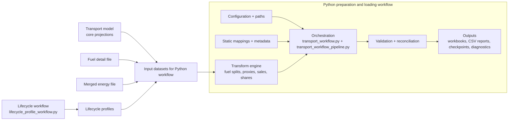

# Process Flow (Plain English + Runbook)

This is now the primary operating document for the transport pipeline.

`docs/START_HERE.md` and `docs/RUNBOOK.md` are merged into this file.

## Background and purpose

This repository exists to bridge the 9th transport model outputs into LEAP-ready inputs for the 10th-edition workflow.

Why this bridge is needed:

- Upstream transport outputs are still in a legacy 9th-edition-shaped structure.
- LEAP import expects a different branch/variable structure, scenario layout, and expression format.
- Base-year energy must be checked and (when enabled) reconciled against ESTO-aligned energy totals.

What this repo does end-to-end:

1. Reads economy/scenario transport outputs.
2. Applies mapping, fuel-split, proxy-row, and share/sales processing logic.
3. Builds LEAP-formatted tables and expressions.
4. Optionally runs reconciliation and diagnostics/dashboards.
5. Writes reproducible outputs, checkpoints, and audit artifacts.

## System view: transport model vs Python prep pipeline

Editable diagram source: `docs/leap-system.drawio`



## 1) Entrypoint and runtime scope

Use `codebase/transport_workflow.py`.

It can run:

1. One economy (for example `20_USA`)
2. All economies separately
3. Synthetic `00_APEC` aggregation
4. Both separate economies + synthetic `00_APEC`

The orchestrator delegates domestic processing to:

- `codebase/functions/transport_workflow_pipeline.py`

and optional international processing to:

- `codebase/functions/international_transport_pipeline.py`

and sales estimation logic via:

- `codebase/sales_workflow.py`
- `codebase/functions/sales_curve_estimate.py`

## 2) Pre-run checklist

- Run from repo root.
- Environment is active (`conda activate ./env_leap`).
- Helper repo is available when imports require it (`pip install -e ../leap_utilities`).
- Economy/scenario exists in `codebase/config/transport_economy_config.py`.
- Expected inputs exist under:
  - `data/transport_data_9th/model_output_detailed_2/`
  - `data/transport_data_9th/model_output_with_fuels/`
  - `data/import_files/DEFAULT_transport_leap_import_TGT_REF_CA.xlsx`
- If `RUN_PROFILE` includes reconciliation, matching checkpoint files exist in `intermediate_data/`.

## 3) Lifecycle stage (upstream)

Run this when survival/vintage assumptions change:

```bash
python3 codebase/lifecycle_profile_workflow.py
```

Primary outputs:

- `data/lifecycle_profiles/vehicle_survival_modified.xlsx`
- `data/lifecycle_profiles/vintage_modelled_from_survival.xlsx`

## 4) Runtime switches you set each run

Top-level switches live in `codebase/transport_workflow.py`.

Minimum set to verify:

- Scope:
  - `TRANSPORT_ECONOMY_SELECTION`
  - `TRANSPORT_SCENARIO_SELECTION`
  - `ALL_RUN_MODE`
- Stage behavior:
  - `RUN_PROFILE` (`input_only`, `reconcile_only`, `full`)
  - `RUN_RESULTS_DASHBOARD`
- Input/checkpoint behavior:
  - `INPUT_DATA_SOURCE` (`raw`, `checkpoint`)
  - `CHECKPOINT_LOAD_STAGE` (`none`, `halfway`, `three_quarter`, `export`)
  - `MERGE_IMPORT_EXPORT_AND_CHECK_STRUCTURE`
- Sales:
  - `SALES_MODE`
  - `SCENARIO_SALES_POLICY_SETTINGS`
- Reconciliation:
  - `APPLY_ADJUSTMENTS_TO_FUTURE_YEARS`
  - `REPORT_ADJUSTMENT_CHANGES`
  - `ESTO_ZERO_ENERGY_FALLBACK_RULES`
- International:
  - `RUN_INTERNATIONAL_WORKFLOW`
  - `INTERNATIONAL_*` flags

Full switch reference: `docs/TRANSPORT_WORKFLOW_SWITCHES.md`

## 5) Economy-level input preparation (domestic)

For each economy/scenario, `prepare_input_data(...)` does this:

1. Load source model data (`csv` or Excel) and filter to selected economy, scenario, and year range.
2. Validate schema using `EXPECTED_COLS_IN_SOURCE`; fail early if required fields are missing.
3. Drop unneeded source columns (`Unit`, `Data_available`, `Measure`) and add canonical `Fuel` labels from mapping logic.
4. Apply medium-specific cleanup (for non-road rows, road-only stock/share fields are zeroed where appropriate).
5. Allocate alternative fuels using the fuel-detail file so energy/activity are split into LEAP-ready fuel rows. This is because leap expects the fuel dimension to be fully disaggregated at the bottom level whereas the 9th transport model output does not have the bottom level data for engine types split by fuel, and instead it is reported in a separate document (see `data/transport_data_9th/model_output_with_fuels/` vs `data/transport_data_9th/model_output_detailed_2/`).
6. Create additional mapped rows:
   - combination rows from configured mapping rules
   - proxy rows for branches with no direct activity input
7. Run duplicate-key checks on the core source tuple (`Date, Economy, Scenario, Transport Type, Medium, Vehicle Type, Drive, Fuel`); write debug output to `data/errors/duplicate_source_rows.csv` on failure.
8. Recompute derived values:
   - `Sales` from stock changes
   - share columns via normalization (`Vehicle_sales_share`, `Stock Share`, and related share families)
9. Insert ESTO “other” rows from merged-energy inputs for missing/non-direct transport categories.
10. Save prepared-input checkpoint to `intermediate_data/transport_data_<economy>_<scenario>_<base>_<final>.pkl`.

## 6) `00_APEC` synthetic run behavior

When all-mode includes APEC, `prepare_apec_input_data(...)` does this:

1. Prepare each economy input dataframe using the same domestic preparation flow (or checkpoints if configured).
2. Concatenate all economy-level prepared dataframes.
3. Re-filter to the requested APEC year window.
4. Aggregate to synthetic economy `00_APEC` by source key (`Date, Scenario, Transport Type, Medium, Vehicle Type, Drive, Fuel`).
5. Apply column-specific aggregation rules:
   - additive fields are summed (for example Energy, Stocks, Activity, GDP, Population, Sales)
   - rate/intensity/share-like fields use weighted averages with measure-specific weights (typically `Activity` or `Stocks`, sometimes `Population`/`New_stocks_needed`)
6. Recalculate post-aggregation derived fields:
   - recalculate `Sales`
   - renormalize shares (`Vehicle_sales_share`, `Stock Share`)
7. Validate no duplicate source keys remain, then save `00_APEC` checkpoint in `intermediate_data/`.

This avoids invalid “average of averages” behavior.

## 7) LEAP export construction

`load_transport_into_leap(...)` builds LEAP-ready output tables and expressions.

Main stages:

1. Resolve runtime paths (export/import/template files, lifecycle files, checkpoint tags) and validate mapping integrity.
2. Load prepared input data (fresh prep or checkpoint) and optionally run passenger/freight sales workflows for sales-driven measures.
3. Initialize empty export dataframe and iterate every `LEAP_BRANCH_TO_SOURCE_MAP` mapping.
4. For each branch mapping:
   - resolve branch path and measure config
   - process mapped measures from input dataframe
   - write rows into export dataframe
5. Save/load midpoint checkpoints depending on `CHECKPOINT_LOAD_STAGE` (`halfway`, `three_quarter`, `export`).
6. Finalize export content:
   - validate/fix share families to sum correctly
   - generate `Current Accounts` rows from scenario data
   - add final metadata (scenario, region, year structure)
   - run base-year energy validation against ESTO totals
7. Convert yearly values to LEAP expression strings and build `LEAP` + `FOR_VIEWING` outputs.
8. If template alignment gate is enabled, enforce strict key match and merge with template IDs/structure.
9. Archive prior workbook (if present) and save final export workbook.

## 8) Template alignment gate (important)

This gate is controlled by:

- `MERGE_IMPORT_EXPORT_AND_CHECK_STRUCTURE`

Template file:

- `data/import_files/DEFAULT_transport_leap_import_TGT_REF_CA.xlsx` (sheet `Export`)

Implementation (current code):

- `codebase/functions/transport_workflow_pipeline.py`
  - `_enforce_exact_template_alignment_keys(...)`
  - `_report_template_alignment_changes(...)`

What it does now:

1. **Strict pre-check**: exported keys (`Branch Path`, `Variable`, `Scenario`) must already exist in the template for both scenario rows and `Current Accounts` rows. `Region` is ignored by this gate.
2. If any exported row is not in template, run fails immediately with `ValueError`.
3. If strict check passes, export is merged with template IDs/structure.
4. A summary is printed and dropped-key reports are written to `results/`:
   - `template_alignment_dropped_<run_tag>_leap_sheet.csv`
   - `template_alignment_dropped_<run_tag>_for_viewing_sheet.csv`

## 9) Reconciliation step (optional)

If `RUN_PROFILE` includes reconciliation, pipeline scales LEAP-side values to match ESTO base-year energy totals and writes reports under `results/reconciliation/`.

For `reconcile_only`, required input checkpoint:

- `intermediate_data/export_df_for_viewing_checkpoint2_<economy>_<scenario>.pkl`

## 10) Dashboard step (optional)

If `RUN_RESULTS_DASHBOARD=True`, the script runs:

- `codebase/results_analysis/results_dashboard_workflow.py`

Inputs expected:

- Comparison CSVs in `results/checkpoint_audit/`:
  - `transport_pre_recon_vs_raw_disaggregated_<economy>_<scenario>.csv`
- Optional reconciliation snapshots in `results/reconciliation/` for reconciled overlays.

Primary outputs (default paths):

- `results/diagnostics/transport_results_series_comparison/comparison_long.csv`
- `results/diagnostics/transport_results_series_comparison/comparison_summary.csv`
- `results/diagnostics/transport_results_series_comparison/charts/`
- `results/diagnostics/transport_results_series_comparison/dashboards/index.html`
- `results/diagnostics/transport_results_series_comparison/dashboards/<economy>.html`

Optional supporting outputs:

- Stock proxy files in `results/diagnostics/stock_projection_exploration/`
- Optional LEAP-results comparison artifacts under
  `results/diagnostics/transport_results_series_comparison/leap_results_tables_comparison/`

What is on the dashboards:

- One dashboard page per economy, plus an `index.html` landing page.
- Group selector (for example Passenger road, Freight road, non-road groups, pipelines, international).
- Within each group:
  - Rows = fuel (or transport+fuel when needed).
  - Columns = metrics (energy, stock, mileage, efficiency, activity, intensity; order varies by group).
  - Each cell = chart image/plot for that metric+fuel.
- Typical chart lines:
  - Input
  - Pre-reconciled
  - Reconciled (when available)
  - Reconciled + alternatives (when available)
  - Optional CP proxy / SF proxy stock lines when proxy series are present.

Practical usefulness:

- Useful for quickly spotting where pre/reconciled series diverge from input by economy, metric, and fuel.
- Not required for producing the transport export workbook itself.

## 11) Execute

Run from repo root:

```bash
python3 codebase/transport_workflow.py
```

## 12) Expected outputs

- Export workbook(s): `results/*transport_leap_export*.xlsx`
- Sales CSVs: `results/passenger_sales_*`, `results/freight_sales_*`
- Reconciliation reports: `results/reconciliation/*.csv`
- Runtime summaries: `results/transport_all_run_summary_*.csv`, `results/runtime_stage_timings_*.csv`
- Checkpoints: `intermediate_data/*.pkl`

## 13) Safe first run profile

Use these for low-risk onboarding:

- `RUN_PROFILE = "input_only"`
- `RUN_INTERNATIONAL_WORKFLOW = False` (optional, faster)
- `INPUT_DATA_SOURCE = "raw"`
- `CHECKPOINT_LOAD_STAGE = "none"`
- `CHECK_BRANCHES_IN_LEAP_USING_COM = False`
- `SET_VARS_IN_LEAP_USING_COM = False`
- `INTERNATIONAL_CHECK_BRANCHES_IN_LEAP_USING_COM = False`
- `INTERNATIONAL_SET_VARS_IN_LEAP_USING_COM = False`

## 14) Current COM note

Both domestic and international pipelines currently hard-stop when COM flags are enabled (LEAP API temporarily disabled in code).

If you see an error like `LEAP API usage is disabled...`, disable COM flags and rerun.

## 15) Adding a new economy

1. Add metadata and scenario config in `codebase/config/transport_economy_config.py`.
2. Confirm model/fuel input files exist.
3. Run `input_only` profile first.
4. Then run full profile when dry run passes.
