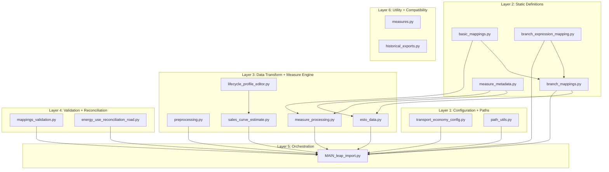
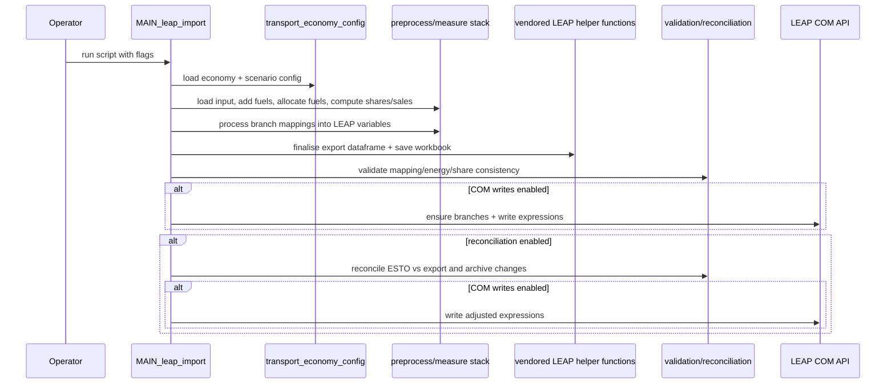

# System Architecture

This document gives a detailed architecture view of the transport LEAP pipeline: components, data flow, run modes, boundaries, and failure points.

## Draw.io source

An editable diagram is included at `docs/leap-system.drawio`. The Mermaid diagrams below provide the same architecture in version-control-friendly text form.

## 1) System context

```mermaid
flowchart LR
    A[Transport model input<br/>CSV/XLSX] --> B[MAIN_leap_import.py]
    F[Transport fuels file<br/>CSV] --> B
    E[ESTO balances<br/>XLSX] --> B
    L[Lifecycle profiles<br/>XLSX] --> B

    B --> C[LEAP export dataframe]
    C --> D[Export workbook in results/]
    C --> R[Reconciliation pipeline]
    R --> D

    B -.optional COM write.-> G[Open LEAP desktop model]
    R -.optional COM write.-> G

    H[intermediate_data checkpoints] <--> B
    I[data/errors diagnostics] <-- B
    J[results/reconciliation reports] <-- R
```

## 2) Layered architecture



## 3) End-to-end runtime flow



## 4) Primary data contracts

### Source transport model dataframe

Owned by: `prepare_input_data` in `code/MAIN_leap_import.py`

Critical fields:

- `Economy`, `Scenario`, `Date`
- structure keys: `Transport Type`, `Medium`, `Vehicle Type`, `Drive`, `Fuel`
- measures: `Energy`, `Stocks`, `Activity`, `Efficiency`, `Mileage`, `Intensity`, `Vehicle_sales_share`, etc.

Schema guard:

- `EXPECTED_COLS_IN_SOURCE` in `code/basic_mappings.py`

### LEAP export dataframe

Constructed by:

- `create_transport_export_df` (external helper), then row population in `MAIN_leap_import.py`

Populated with:

- `Branch Path`, `Variable`, `Scenario`, yearly values, metadata (`Units`, `Scale`, `Per...`)
- converted to `Expression` through `convert_values_to_expressions`

Persisted as:

- workbook under configured `results/*.xlsx`
- checkpoint pickles in `intermediate_data/`

### Reconciliation working dataframe

Created in `run_transport_reconciliation` and passed through adjustment callbacks in `code/energy_use_reconciliation_road.py`.

Outputs:

- adjusted export workbook
- change reports in `results/reconciliation/`
- archived prior outputs in `results/archive/` and `results/reconciliation/archive/`

## 5) Control-plane flags (behavior switches)

Top-level stage gates (bottom of `code/MAIN_leap_import.py`):

- `RUN_PROFILE` (`input_only`, `reconcile_only`, `full`)
- `SALES_MODE` (`none`, `passenger`, `freight`, `both`)
Derived:

- `RUN_INPUT_CREATION`
- `RUN_RECONCILIATION`

COM integration gates:

- `CHECK_BRANCHES_IN_LEAP_USING_COM`
- `SET_VARS_IN_LEAP_USING_COM`
- `AUTO_SET_MISSING_BRANCHES`

Checkpoint gates:

- `INPUT_DATA_SOURCE` (`raw`, `checkpoint`)
- `CHECKPOINT_LOAD_STAGE` (`none`, `halfway`, `three_quarter`, `export`)

Reconciliation behavior:

- `APPLY_ADJUSTMENTS_TO_FUTURE_YEARS`
- `REPORT_ADJUSTMENT_CHANGES`

## 6) External dependency boundaries

### Vendored helper snapshot

- `codebase/functions/leap_utilities_functions.py`
- imported from the sibling `leap_utilities` repo on 16/04/2026
- review against upstream by 16/04/2027
- used for expression writing, workbook assembly, and generic reconciliation helpers

### LEAP desktop COM boundary

Used only when COM flags are enabled.

Risks:

- branch creation limits for some road stock/demand fuel structures
- runtime instability if LEAP UI is interacted with during writes

## 7) Failure surfaces and observability

Failure surfaces:

- input schema mismatch
- duplicate row explosion after proxy/combo synthesis
- branch/mapping mismatches
- COM branch/variable absence
- reconciliation non-convergence

Observability artifacts:

- `data/errors/duplicate_source_rows.csv`
- console warnings/errors from mapping/validation
- reconciliation change files in `results/reconciliation/`
- checkpoint snapshots in `intermediate_data/`

## 8) Ownership map by concern

- Branch and measure semantics: `code/branch_mappings.py`, `code/measure_metadata.py`
- Data transform correctness: `code/preprocessing.py`, `code/measure_processing.py`
- Output integrity checks: `code/mappings_validation.py`
- Reconciliation strategy: `code/energy_use_reconciliation_road.py`
- Runtime operations and handover: `code/MAIN_leap_import.py`, `docs/RUNBOOK.md`
